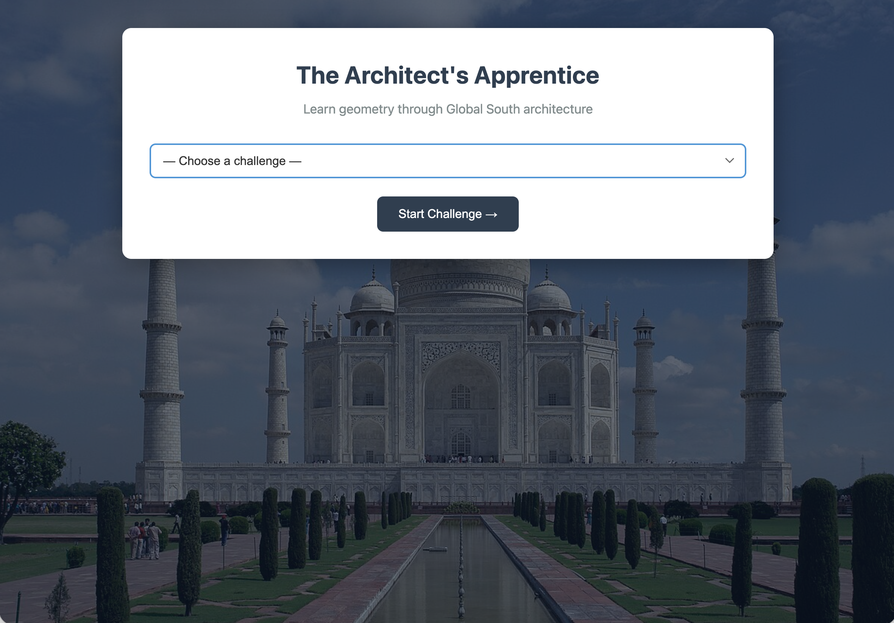
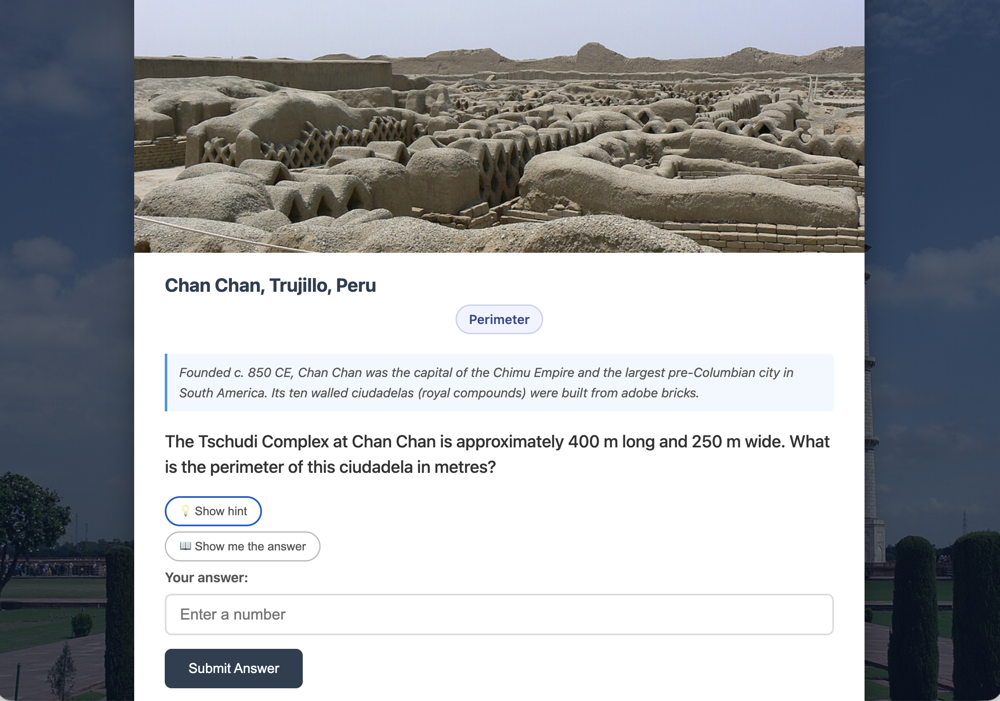

# The Architect's Apprentice

**An interactive exploration of geometry through the lens of architecture in the Global South.**

[▶ Live Demo](https://architects-apprentice.vercel.app/)

---



---

## About

The Architect's Apprentice presents geometry problems grounded in real buildings across the Global South. Each challenge is rooted in the actual dimensions of a landmark — from the Great Pyramid of Giza to the Tomb of Askia in Mali — and accompanied by cultural context about the site.

Submit an answer and the Claude AI gives you personalised Socratic feedback: if you're right, it deepens the question; if you're off, it nudges you toward the answer without giving it away. A hint and a step-by-step answer reveal are always available.



**24 challenges across 8 countries:**

| Country | Buildings |
|---------|-----------|
| 🇪🇹 Ethiopia | Bete Giyorgis (Lalibela) · Fasil Ghebbi (Gondar) · Obelisk of Axum |
| 🇲🇽 Mexico | El Castillo (Chichen Itza) · Pyramid of the Sun (Teotihuacan) · Monte Albán |
| 🇮🇳 India | Taj Mahal (Agra) · Qutb Minar (Delhi) · Jantar Mantar (Jaipur) |
| 🇪🇬 Egypt | Great Pyramid of Giza · Karnak Temple Complex · Abu Simbel |
| 🇰🇭 Cambodia | Angkor Wat · Bayon (Angkor Thom) · Banteay Srei |
| 🇵🇪 Peru | Machu Picchu · Sacsayhuamán (Cusco) · Chan Chan (Trujillo) |
| 🇯🇴 Jordan | Al-Khazneh (Petra) · Oval Forum (Jerash) · Wadi Rum |
| 🇲🇱 Mali | Great Mosque of Djenné · Sankore Mosque (Timbuktu) · Tomb of Askia (Gao) |

**Concepts covered:** Area · Perimeter · Trigonometry · Circles · Pythagoras · Symmetry · Slope & Angles

---

## Running locally

The game is a single `index.html` file — no build step, no dependencies for the frontend.

```bash
git clone https://github.com/funksoup/Architects_Apprentice.git
cd Architects_Apprentice
open index.html
```

> **Note:** When running locally, `/api/claude` won't be available. To test the full experience including Claude feedback, deploy to Vercel (see below) or run a local server that handles the API route.

---

## Deploying to Vercel

The live demo runs on [Vercel](https://vercel.com) with a serverless function that proxies requests to the Claude API — no API key is exposed to the browser.

1. Fork or clone this repo and push to GitHub
2. Import the repo into Vercel (Add New Project → Import Git Repository)
3. In Vercel → Settings → Environment Variables, add:
   ```
   API_KEY=sk-ant-...
   ```
4. Deploy — Vercel will auto-deploy on every push to `main`

---

## Built with

- Vanilla HTML, CSS, and JavaScript (single file, no frameworks)
- [Claude API](https://www.anthropic.com/api) (`claude-sonnet-4-20250514`) for Socratic feedback
- [Vercel](https://vercel.com) serverless functions for secure API proxying
- Images from [Wikimedia Commons](https://commons.wikimedia.org/)
